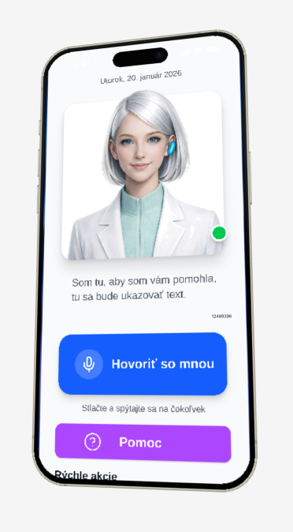
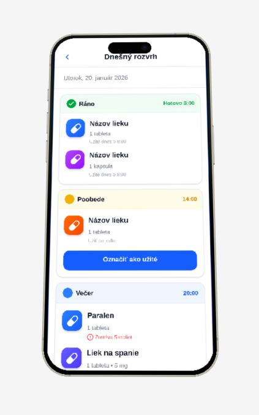
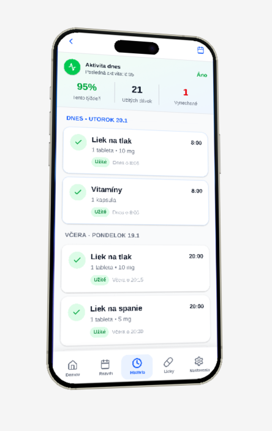
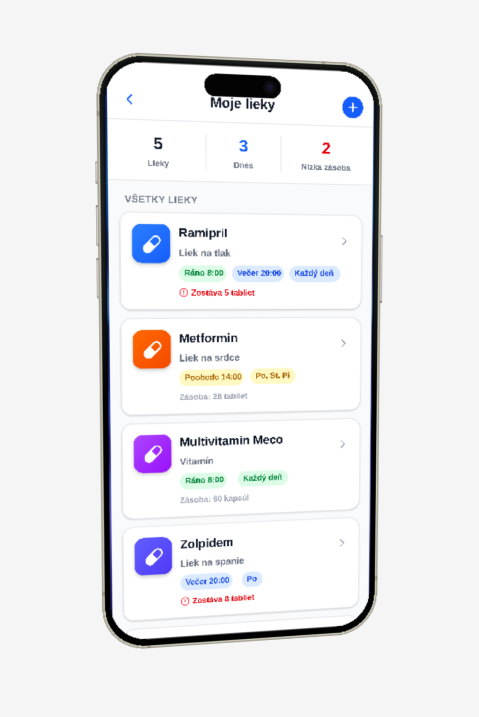
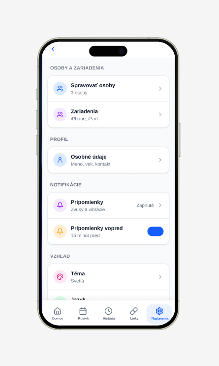

# Alena — Voice-First Medication Assistant

> AI asistentka pre slovenských seniorov (65+), ktorá pomáha nezabúdať na lieky.  
> Voice-first. Slovenčina. Beží offline.

> **Note:** This is a UI demo repository. Full source is private (medical app, GDPR-sensitive architecture).  
> Shown here: complete screen designs + `MedicationsScreen` component as a representative code sample.

---

## Screenshots

  
  
  
  
  

---

## What it does

Alena is a medication reminder app designed specifically for Slovak seniors who:
- are not comfortable with complex smartphone UIs
- prefer speaking over typing
- need reminders in correct Slovak (not Google-translated)

**Core flows:**
- Voice interaction ("Hovoriť so mnou") — ask Alena anything about your schedule
- Daily schedule view — morning / afternoon / evening doses with one-tap confirmation
- Medication list — color-coded cards per medication with supply warnings
- History + adherence stats — 95% adherence rate, doses taken/missed
- Settings — manage multiple persons (caregiver use case), notification preferences

---

## Design decisions worth noting

**Color-coded medication icons** — each medication gets a unique gradient (blue, orange, purple, indigo, pink). Seniors can identify their medication by color without reading the name.

**Supply warnings** — red alert when stock drops below threshold (`Zostáva 5 tabliet`). Prevents missed doses due to empty supply.

**Caregiver mode** — Settings → "Spravovať osoby" allows a family member to manage multiple seniors from one device.

**Pill tags** — schedule shown as compact colored pills (`Ráno 8:00`, `Každý deň`) instead of text lists. Faster to scan.

---

## Code sample — `MedicationsScreen.tsx`

The medications screen demonstrates:
- Reusable `MedicationCard` component with typed props
- `LinearGradient` per-medication color theming
- Dynamic pill tags with 4 tone variants (`green` / `blue` / `yellow` / `gray`)
- SVG icon injection via typed `React.ComponentType` prop
- `StyleSheet` with consistent 8pt spacing grid

See [`src/screens/MedicationsScreen.tsx`](src/screens/MedicationsScreen.tsx)

---

## Stack

| Layer | Technology |
|-------|-----------|
| Framework | React Native + Expo SDK 52 |
| Language | TypeScript |
| Navigation | Expo Router |
| Animations | React Native Reanimated |
| Icons | SVG (Figma export via react-native-svg) |
| Gradients | expo-linear-gradient |
| Voice | expo-speech (TTS) + expo-av |
| Notifications | expo-notifications (scheduled) |
| Storage | AsyncStorage (offline-first) |
| Build | EAS Build |

---

## Project status

| Screen | UI | Logic |
|--------|----|----|
| Home (Alena avatar + voice) | ✅ | 🚧 |
| Daily schedule | ✅ | 🚧 |
| History + stats | ✅ | 🚧 |
| Medications list | ✅ | 🚧 |
| Settings | ✅ | 🚧 |
| Add medication | ✅ | 🚧 |
| Reminder notification | ✅ | 🚧 |
| Voice interaction | 🚧 | 🚧 |

UI complete. Backend + voice integration in progress.  
Applying for **SBA Inovuj** grant (digital health category).

---

## Contact

**Sebastian** · AI engineer · Bratislava, Slovakia  
[github.com/sebastian414](https://github.com/sebastian414)
